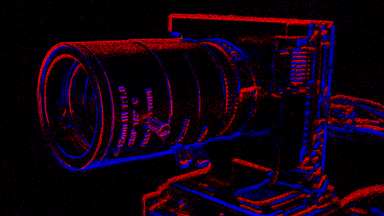

# libcaer_driver

A ROS2 driver for event based cameras using Inilab's Libcaer (Davis, DvXplorer).
This driver is not written or supported by Inilabs.



This driver is intended to be a successor to the University of Zuerich
[ROS1 driver](https://github.com/uzh-rpg/rpg_dvs_ros).
The ROS2 port addresses some deficiencies of the ROS1 driver, in particular
the performance problems due to the message format.
Usage of the [event_camera_msgs](https://github.com/ros-event-camera/event_camera_msgs/)
format allows for higher bandwidth and more efficient storage.

The events can be decoded and displayed using the following ROS/ROS2 packages:

- [event_camera_codecs](https://github.com/ros-event-camera/event_camera_codecs)
  has C++ routines to decode event_camera_msgs.
- [event_camera_py](https://github.com/ros-event-camera/event_camera_py)
  module for fast event decoding in python.
- [event_camera_renderer](https://github.com/ros-event-camera/event_camera_renderer)
  a node / nodelet that renders and publishes ROS image messages.
- [event_camera_tools](https://github.com/ros-event-camera/event_camera_tools)
  a set of tools to echo, monitor performance and convert
  [event_camera_msgs](https://github.com/ros-event-camera/event_camera_msgs) to legacy formats and into "RAW" format.

## Supported platforms

Tested on the following platforms:

- ROS2 Humble on Ubuntu 22.04 LTS

Tested with the following hardware:

- [Davis 240C](https://inivation.com/wp-content/uploads/2019/08/DAVIS240.pdf)
- [DvXplorer](https://shop.inivation.com/collections/dvxplorer)

## How to build

Prerequisites:

Install ``vcs`` (ubuntu package ``python3-vcstool``).

Make sure you have your ROS2 environment sourced such that the ROS_VERSION environment variable is set.

Create a workspace (``libcaer_driver_ws``), clone this repo, and use ``vcs``
to pull in the remaining dependencies:

```
pkg=libcaer_driver
mkdir -p ~/${pkg}_ws/src
cd ~/${pkg}_ws
git clone https://github.com/ros-event-camera/${pkg}.git src/${pkg}
cd src
vcs import < ${pkg}/${pkg}.repos
cd ..
```

Now build (the cmake flag to export compile commands is optional):
```
colcon build --symlink-install --cmake-args -DCMAKE_BUILD_TYPE=RelWithDebInfo -DCMAKE_EXPORT_COMPILE_COMMANDS=ON
. install/setup.bash
```

This driver provides its own version of ``libcaer``, but you still need to copy the udev file into place
and modify the group permissions:
```
sudo cp src/libcaer/lib/udev/rules.d/65-inivation.rules /etc/udev/rules.d/
sudo usermod -aG video ${USER}
sudo usermod -aG plugdev ${USER}
sudo udevadm trigger
sudo service udev restart
```
Now you need to log out and back in to the host in order for the updated group permissions to take hold.


## Driver Features

Parameters:

- ``device_type``: "davis", "dvxplorer", ...
- ``event_message_time_threshold``: (in seconds) minimum time span of
  events to be aggregated in one ROS event message before message is sent. Defaults to 1ms.
- ``event_message_size_threshold``: (in bytes) minimum size of events
  (in bytes) to be aggregated in one ROS event message before message is sent. Defaults to 1MB.
- ``encoding``: ``libcaer_cmp``(compressed, default) or ``libcaer`` (uncompressed). The CPU usage for encoding is very small, and can actually *reduce* the CPU load on the driver because of the reduction of memory access when sending the message. Use of uncompressed ``libcaer`` is strongly discouraged. Only use ``libcaer`` encoding if low event rates are expected, and decompression latency is an issue.
- ``camera_frame_id``: the ROS frame id to use in the header of event and image messages
- ``imu_frame_id``: the ROS frame id to use in the header of imu messages
- ``send_queue_size``: outgoing ROS message send queue size (defaults to 1000 messages).
- ``serial``: specifies serial number of camera to open (useful if you have multiple cameras connected). You can learn the serial number via ``lsusb -v -d 152a: | grep iSerial``, or just start the driver with the serial number left blank, and look at the console log.
- ``statistics_print_interval``: time in seconds between statistics printouts.

## How to use:

Use the standard ROS launch procedure to start the driver, for instance:
```
ros2 launch libcaer_driver driver_node.launch.py device_type:=davis
```
Edit ``driver_node.launch.py`` to set various parameters, or use ``rqt_reconfigure`` to modify the parameters on the fly.

For efficient recording of the events you need to run the
driver and the recorder in the same address space using ROS2 composable
nodes. For this you will need to install the
[composable recorder](https://github.com/berndpfrommer/rosbag2_composable_recorder)
into your workspace as well (see below). There are some example launch files provided
for launching the combined driver/recorder:
```
ros2 launch libcaer_driver recording_dvxplorer_composition.launch.py # (run as composable node)
```
Once the combined driver/record is running, start the recording like so:
```
ros2 service call /start_recording std_srvs/srv/Trigger
```
To stop the recording you have to kill (Ctrl-C) the recording driver.

To visualize the events, run a ``renderer`` node from the
[event_camera_renderer](https://github.com/ros-event-camera/event_camera_renderer) package:
```
ros2 launch event_camera_renderer renderer.launch.py
```
The renderer node publishes an image that can be visualized with e.g. ``rqt_image_view``

## Performance comparison to the ROS1 driver

Here are some approximate performance numbers on a 16 thread (8-core) AMD Ryzen 7480h laptop with max clock speed of 2.9GHz. The below numbers were obtained with a DvXplorer (bias sensitivity set to 4, sensor illuminated uniformly with square wave at 600Hz, delivering about 130-145 MeVs, 1150MB/s). Note that at this data rate, the decoding of the USB packets by libcaer saturates the CPU, so some data is lost before it even reaches the driver. ROS ``event_message_time_threshold`` was set to 1ms. 

| settings                            |encoding    |CPU load   | event rate *| note                                  |
|-------------------------------------|------------|-----------|-----------|----------------------------------------|
| ROS2 driver no subscriber           |libcaer_cmp | 100%      | 139 Mev/s | topic not publ., libcaer saturates CPU|
| ROS2 driver + recorder (composable) |libcaer_cmp | 188%      | 136 Mev/s | no message transport involved |
| ROS2 driver + recorder (nodes)      |libcaer_cmp | 172%+25%  | 139 Mev/s | FASTRTPS rmw inter-process comm.|
| ROS2 driver + recorder (composable) |libcaer     | 253%      | 129 Mev/s | no message transport involved |
| ROS2 driver + recorder (nodes)      |libcaer     | 156%+156% | 119 Mev/s | FASTRTPS rmw inter-process comm.|
|-------------------------------------|------------|-----------|-----------|---------------------------------|
| ROS1 driver no subscriber           | dvs_msgs   | 200%      |  28 Mev/s | ROS1 libcaer + driver saturate **|
| ROS1 driver + recorder (nodelet)    | dvs_msgs   | 250%      |  26 Mev/s | no message transport involved |

Notes:
* event rates are incoming event rates.
** the ROS1 driver marshals a ROS message even if there are no subscribers

Storage requirements:
- ROS2 using ``libcaer_cmp`` encoding: about 0.615 bytes/event (uniform flicker) - 5.4 bytes/event (random noise)
- ROS2 using ``libcaer`` encoding: 8 bytes/event
- ROS1: 13 bytes/event


## About time stamps

The libcaer event cameras have their own clock which will here be called *camera clock*.
When the driver starts up, it sends a command to the camera to reset the *camera clock* to zero,
but at the same time the driver also records the *host time* (ROS system clock).
Subsequently it always adds that initial *host time* to the *camera clock*. This sum of host time and camera clock
will be referred to as *sensor time*. Note that although initially *sensor time* and *host time* coincide, they can drift arbitrarily far away from each other due to clock skew.

The time stamps in the different messages refer to different clocks as follows:
- IMU message ``header.stamp``: *sensor time*
- image message ``header.stamp``: *sensor time*
- EventPacket message:
  - ``header.stamp``: *host time* (host arrival time of first libcaer packet that was used to form the ROS message)
  - ``time_base``: *sensor time* (sensor arrival time of first libcaer packet that was used for ROS message)
  - event time stamps: *sensor time*

Note that the ``header.stamp`` for EventPacket messages follows a different(!) convention than the header stamps for IMU and image messages. The reason is that ``time_base`` of the EventPacket message already has the *sensor time*, so ``header.stamp`` is used to capture the actual *host time*. This permits estimation of the clock drift between *sensor time* and *host time*, which in turn allows synchronization with data (captured from other sensors) that refers to *host time* only.

In summary, IMU, image, and individual event times all refer *sensor time* and can be directly compared to each other. The header stamp in the event packets however *does not* refer to *sensor time*.

## License

This software is issued under the Apache License Version 2.0.
